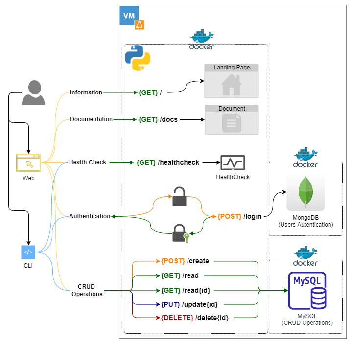

# FastAPI - CRUD API 

This is a demo API that you can use as a starting point for many CRUD operations type projects. To build this demo, I'm using [FastAPI](https://fastapi.tiangolo.com/), an extremely popular web framework for building APIs with Python.

> :bulb: A CRUD API is an API that can perform CREATE, READ, UPDATE, and DELETE operations on a database.

Current features of the CRUD API:

- **Landing page**: 100% unnecessary in a CRUD API but nice to have.
- **Auto generated documentation**: Powered by FastAPI
- **HealtCheck Endpoint**: Return  a JSON response with an 200 HTTP status code and the hostname of the container where the app is running (For debugging).
- **Authentication Endpoint**: To perform CRUD operations, the user must be authenticated with a [bearer token](https://swagger.io/docs/specification/authentication/bearer-authentication/), at the authentication endpoint, the user can login with a set of predefined credentials, the application will validate the credentials against a [MongoDB collection](https://www.mongodb.com/docs/manual/core/databases-and-collections/#collections) and return a bearer token.
- **CRUD Endpoints**: Secure endpoints to CREATE, READ, UPDATE, and DELETE users from a MySQL Table.


# Prerequisites:

In this project I am using two types of databases, MySQL for the  CRUD operations and MongoDB for user authentication. Why? just for fun :man_shrugging: , if you want to do the same, you must have these databases running and configured before deploying the CRUD API.

In this project I used Docker containers for both the MySQL database and the MongoDB database, if you want to deploy the databases in the same way, follow these instructions:

<details>
  <summary>Click to reveal instructions:</summary>
  
  ### Heading
  1. Foo
  2. Bar
     * Baz
     * Qux

  ### Some Code
  ```yaml
    version: '3'

    services:
    db:
        image: mysql:latest
        container_name: MySQL
        command: --default-authentication-plugin=mysql_native_password
        restart: unless-stopped
        environment:
        - MYSQL_ROOT_PASSWORD=
        - TZ=America/Argentina/Buenos_Aires
        volumes:
        - /docker/MySQL/mysql_data:/var/lib/mysql
        - /etc/timezone:/etc/timezone:ro
        - /etc/localtime:/etc/localtime:ro
        ports:
        - 3306:3306/tcp

    adminer:
        image: adminer:latest
        container_name: MySQL_adminer
        restart: always
        ports:
        - 8480:8080/tcp
  ```

  ```yaml

  ```
</details>

# Solution Diagram:



## Tested with: 

| Environment | Application | Version  |
| ----------------- |-----------|---------|
| WSL2 Ubuntu 20.04 | Python | v3.9.5  |
| WSL2 Ubuntu 20.04 | Docker | v20.10.17 |

## Pre-Build steps:

Create a file called `mongodb_cred.yml` inside the config folder with a content like the following:

```yaml
#mongodb Connection and credentials definition
mongodb_host: '192.168.111.222'
mongodb_port: '27017'
mongodb_user: 'root'
mongodb_password: 'SuperSecretPassword'
mongodb_db: 'login'
mongodb_collection: 'users'
```
> :warning: Change the values accordingly

Create a file called `mysql_cred.yml` inside the config folder with a content like the following:

```yaml
#MySQL Connection and credentials definition
mysql_host: '192.168.111.222'
mysql_port: '3306'
mysql_user: 'root'
mysql_password: 'SuperSecretPassword'
mysql_db: 'crud_api'
```

> :warning: Change the values accordingly

Generate an .env file with a JSON Web Token secret, this will be use to encode/decode the users token:

```bash
echo "JWT_SECRET=$(openssl rand -hex 32)" > .env && source .env && echo $JWT_SECRET
```

In the end this should be your folder structure (images folder is excluded):

```bash
├── Dockerfile
├── app.py
├── .env
├── config
│   ├── db.py
│   ├── jwt_functions.py
│   ├── mongodb_cred.yml
│   └── mysql_cred.yml
├── crud_api.sh
├── landing_page
│   ├── assets
│   │   └── favicon.ico
│   ├── css
│   │   └── styles.css
│   ├── index.html
│   └── js
│       └── scripts.js
├── log_conf.yml
├── middleware
│   └── verify_token.py
├── models
│   └── users.py
├── rebuild_container.sh
├── requirements.txt
├── routes
│   ├── auth.py
│   └── crud.py
└── schemas
    └── user.py
```` 
# Build the Docker container:

```bash
docker build -t jmanzur/crud_api .
```

```bash
docker run -d -p 8082:8082 --name CRUD_API jmanzur/crud_api
```
## Debugging / Troubleshooting:

#### **Debugging Tip #1**:

To make development and testing easier, you can use the `rebuild_container.sh` script to remove and rebuild the image:

```bash
./rebuild_container.sh
````

- [@JManzur](https://jmanzur.com)

## Documentation:

[FastAPI - Metadata and Docs URLs](https://fastapi.tiangolo.com/tutorial/metadata/)
[FastAPI in Containers - Docker](https://fastapi.tiangolo.com/deployment/docker/)